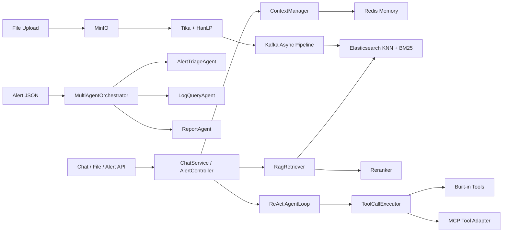

# 知识问答与告警分析 Agent

面向运维知识问答与告警分析场景的 Java AI Agent 项目。后端基于 **Spring Boot 3.5 + LangChain4j 1.1** 构建,使用 LangChain4j 作为模型接入层,但核心链路编排、RAG 检索、工具治理、上下文管理和多 Agent 调度都由项目自行实现。

## 核心功能

### 1. RAG 知识库

构建了完整的 **文档上传 -> 解析切分 -> 向量化入库 -> 混合检索** 知识库链路:

- 文件进入 MinIO 后由 Apache Tika 解析,HanLP 辅助中文句边界处理,按 parent-child chunk 写入知识库。
- chunkId 基于 `sha256(source + content)` 生成,写 Elasticsearch 时作为 `_id`,重复入库会被 UPSERT 幂等吸收。
- 检索层基于 **Elasticsearch 8.10 + IK 中文分词 + dense_vector**,支持 KNN 语义召回与 BM25 关键词召回。
- 当前 ES 主路径把 **KNN + match + rescore** 放在单次 ES 调用内完成 native hybrid;非 native 路径保留 RRF/线性融合能力。
- Top-N 召回后可接入 Reranker 重排。C-MTEB T2Retrieval 采样集上,Qwen3-Reranker-8B 让 nDCG@10 从 0.86 提升到 0.91,提升 **5.6 个百分点**。

### 2. 会话记忆与上下文管理

基于 Redis 持久化会话消息,在调 LLM 前由 `ContextManager` 统一打包上下文:

- 上下文结构按 **系统提示词 + 历史摘要 + 用户稳定事实 + 最近消息 + RAG 检索证据 + 当前问题** 组织。
- `MessageSummaryCompressor` 对长历史做摘要折叠,`FactExtractor` 通过规则抽取用户稳定事实。
- token 超预算时按优先级动态裁剪:先裁旧消息,再裁旧事实,再移除摘要,最后压缩 evidence;同时保留最近 1 轮消息作为上下文下限。
- 极端预算仍无法满足时,`contextStrategy` 会标记 `-overflow`,方便在 Trace 和日志中定位上下文失控。
- `ContextManagerBenchmark` 显示:50 轮 SRE 问答场景输入 token 减少 **75.8%**,100 轮减少 **86.4%**,从 raw O(N) 增长收敛到约 1010 token。

### 3. 工具治理与 MCP 扩展

项目把内置工具和外部 MCP 工具统一收敛到 `ToolDefinition` 抽象:

- 每个工具提供 name / description / JSON Schema 参数定义,并可导出 LangChain4j `ToolSpecification` 给 function calling 使用。
- `ToolCallExecutor` 支持多个 tool call 并行执行,工具失败不会抛穿主链路,而是转成 observation 回投给 LLM。
- 调用前会做 JSON Schema 参数校验、未知工具兜底、重复调用 loop 检测,降低参数幻觉和无效循环风险。
- 对有副作用的工具支持 HITL 审批:工具调用先进入 `PendingToolCallStore`,前端/接口批准后才继续执行。
- `McpToolAdapter` 将外部 MCP server 暴露的工具封装成内部 `ToolDefinition`,复用同一套执行、校验、审批与 Trace 链路。

### 4. Agent 多轮执行循环

基于 ReAct 思路实现 `AgentLoop`,把单趟"判断 -> 执行 -> 回答"升级为多轮循环:

- 每轮由 LLM 产生思考结果或 tool call;有 tool call 时执行工具并把结果作为 observation 追加回上下文。
- 默认最多 4 轮,防止 Agent 陷入无限循环;达到上限时返回带 partial observations 的降级结果。
- `LoopDetector` 记录相同工具和参数的重复调用,第 3 次起转成显式失败信号。
- SpanCollector 为每次 LLM 调用、工具调用和 Agent iteration 记录嵌套 span,前端可以展开 Trace 树查看决策过程。
- 多 Agent 场景下可给每个 specialist 限定工具白名单,避免单个 Agent 暴露全量工具面。

### 5. 告警分析 Agent 编排

围绕 **告警解析 -> 处置手册检索 -> 日志/指标取证 -> 结果分析 -> 处理建议生成** 搭建了 SRE 告警分析流程:

- `AlertController` 暴露 `POST /api/alert` 与 `POST /api/alert/stream`,支持同步报告和 SSE 流式阶段事件。
- `MultiAgentOrchestrator` 由 supervisor LLM 决定下一步任务,最多 5 轮路由。
- 默认 specialist 包括 `AlertTriageAgent`、`LogQueryAgent`、`ReportAgent`。
- Triage 阶段先从知识库检索 runbook;LogQuery 阶段通过日志/指标工具取证;Report 阶段只基于已有事实生成 Markdown 分析报告。
- 若 supervisor 未在轮次内进入 ReportAgent,编排器会触发安全阀补一次报告生成,保证告警请求有可读输出。

## 其他能力

- **异步文件入库**:Kafka KRaft producer 使用 `acks=all + idempotence=true + transactional.id`,HTTP 上传可立即返回 202;consumer 采用 at-least-once + DLT,ES `_id=chunkId` 吸收重投递,实现 exactly-once-effect。
- **Self-RAG / Reflection**:`SelfRagOrchestrator` 与 `ReflectionLoop` 为检索质量判断、问题改写和回答自检保留了可扩展节点。
- **评测体系**:内置 `BaselineEvalRunner`、`RankingMetrics`、C-MTEB fixture loader,指标覆盖 Hit / Recall / MRR / nDCG / latency / keyword coverage。
- **可观测性**:Micrometer + Prometheus 指标、结构化日志、TraceArchive、嵌套 span tree、SSE stage 事件。
- **前端控制台**:React + TypeScript 实现聊天、SSE 流式输出、Trace 折叠、HITL 审批、知识库弹窗和 SRE demo 面板。

## 技术栈

| 层 | 技术 |
|---|---|
| 后端框架 | Java 21, Spring Boot 3.5, Maven Wrapper |
| LLM 接入 | LangChain4j 1.1, OpenAI-compatible Chat / Embedding / Rerank endpoint |
| 知识库 | Elasticsearch 8.10, IK 中文分词, dense_vector, KNN, BM25, rescore |
| 文件入库 | MinIO, Apache Tika, HanLP, parent-child chunk, SHA-256 chunkId |
| 异步管线 | Kafka 3.7 KRaft, transactional producer, at-least-once consumer, DLT |
| 记忆与缓存 | Redis session / memory / upload bitmap, in-memory fallback |
| Agent 编排 | ReAct AgentLoop, Supervisor + specialist multi-agent, HITL approval |
| MCP | MCP Java SDK, stdio / streamable-http server config, MCP adapter |
| 评测 | 自实现 IR metrics, C-MTEB T2Retrieval sampled fixture, benchmark profile |
| 前端 | React 19, TypeScript, Vite, SSE, Trace panel |

## 架构概览



## 本地快速启动

### 1. 环境要求

- Java 21
- Node.js + npm(仅前端需要)
- Redis / Elasticsearch / MinIO / Kafka / Docker / npx

真实链路需要在 `.env` 中配置模型和中间件连接信息。

### 2. 启动后端

mock / in-memory 快速启动:

```bash
./mvnw spring-boot:run
```

真实 LLM + ES / Redis / MinIO / Kafka 链路使用 `.env` 开关:

```properties
ZHITU_LLM_MOCK_MODE=false
ZHITU_CHAT_BASE_URL=
ZHITU_CHAT_API_KEY=
ZHITU_CHAT_MODEL_NAME=

ZHITU_EMBEDDING_URL=
ZHITU_EMBEDDING_API_KEY=
ZHITU_EMBEDDING_MODEL_NAME=
ZHITU_EMBEDDING_DIMENSIONS=

ZHITU_RERANK_ENABLED=true
ZHITU_RERANK_URL=
ZHITU_RERANK_API_KEY=
ZHITU_RERANK_MODEL_NAME=

ZHITU_REDIS_ENABLED=true
ZHITU_ES_ENABLED=true
ZHITU_MINIO_ENABLED=true
ZHITU_KAFKA_ENABLED=false
```

启动:

```bash
./mvnw spring-boot:run -Dspring-boot.run.profiles=local
```

### 3. 启动前端

```bash
cd frontend
npm install
npm run dev
```

默认访问 `http://localhost:5173`。

## 常用接口

| 路径 | 用途 |
|---|---|
| `GET /api/healthz` | 健康检查 |
| `POST /api/sessions` | 创建会话 |
| `GET /api/sessions/{sessionId}` | 查看会话历史 |
| `POST /api/chat` | 普通 JSON 对话 |
| `POST /api/streamChat` | SSE 流式对话主入口 |
| `POST /api/knowledge` | 直接写入文本知识 |
| `POST /api/files/upload` | 文件上传;同步 200 或异步 202 |
| `POST /api/files/chunk` | 分片上传 |
| `POST /api/files/merge` | 合并分片并触发入库 |
| `GET /api/files/status/{uploadId}` | 查询异步解析状态 |
| `GET /api/tool-calls/pending` | 查询待审批工具调用 |
| `POST /api/tool-calls/{id}/approve` | 批准 HITL 工具调用 |
| `POST /api/tool-calls/{id}/deny` | 拒绝 HITL 工具调用 |
| `POST /api/alert` | 告警分析同步报告 |
| `POST /api/alert/stream` | 告警分析 SSE 阶段流 |
| `GET /actuator/prometheus` | Prometheus metrics |

## Demo 命令

普通对话 / RAG:

```bash
curl -N -H "Content-Type: application/json" \
  -d '{"sessionId":"demo","message":"什么是 Apache Tika?"}' \
  http://localhost:8080/api/streamChat
```

文件入库:

```bash
curl -F file=@docs/m2-smoke-sample.txt http://localhost:8080/api/files/upload
```

告警分析:

```bash
curl -N -H "Content-Type: application/json" \
  --data-binary @src/main/resources/sre-fixtures/alerts/alert-001.json \
  http://localhost:8080/api/alert/stream
```

重要数字:

| 实验 | 结果 |
|---|---|
| C-MTEB rerank ablation | nDCG@10 0.8554 -> 0.9117,+5.6 pp;p50 latency 1.5s -> 5.6s |
| ContextManager benchmark | 50 轮输入 token -75.8%,100 轮 -86.4% |


## 已知边界

1. C-MTEB 目前使用采样 fixture(2000 corpus / 300 queries),绝对值不直接对标完整 MTEB leaderboard;同 fixture 内 ablation 的 Delta 才是有效信号。

## License

MIT
