# 知途 Agent

面向运维（SRE/DevOps）知识问答与告警分析的 Java AI Agent 项目。

## 技术栈

| 层 | 技术 |
|---|---|
| 后端框架 | Java 21, Spring Boot 3.5, Maven |
| LLM 接入 | LangChain4j 1.1, OpenAI-compatible API |
| 知识库 | Elasticsearch 8.10, IK 分词, KNN + BM25 hybrid |
| 文件入库 | MinIO, Apache Tika, HanLP |
| 异步管线 | Kafka 3.7 KRaft, transactional producer |
| 记忆与缓存 | Redis |
| Agent 编排 | ReAct AgentLoop, Supervisor + Specialist |
| MCP 扩展 | MCP Java SDK |
| 前端 | React 19, TypeScript, Vite, SSE |
| 监控 | Micrometer, Prometheus |

## 核心功能

- **RAG 知识库**：文档上传 → 解析切分 → 向量化 → 混合检索 → 重排序
- **会话记忆**：上下文管理、摘要压缩、事实抽取、Token 预算裁剪
- **工具治理**：JSON Schema 校验、并行执行、HITL 审批、MCP 扩展
- **Agent 循环**：ReAct 多轮执行、环检测、嵌套 span trace
- **SRE 编排**：Supervisor 路由 + AlertTriageAgent + LogQueryAgent + ReportAgent

## 其他能力

- **异步文件入库**：Kafka KRaft 事务 producer + at-least-once consumer + DLT，HTTP 上传立即返回 202
- **Self-RAG / Reflection**：检索质量判断、问题改写、回答自检
- **评测体系**：BaselineEvalRunner、RankingMetrics、C-MTEB fixture loader
- **可观测性**：Micrometer + Prometheus 指标、结构化日志、TraceArchive、嵌套 span tree
- **前端控制台**：React + TypeScript，聊天、SSE 流式、Trace 面板、HITL 审批、SRE Demo

## 架构概览

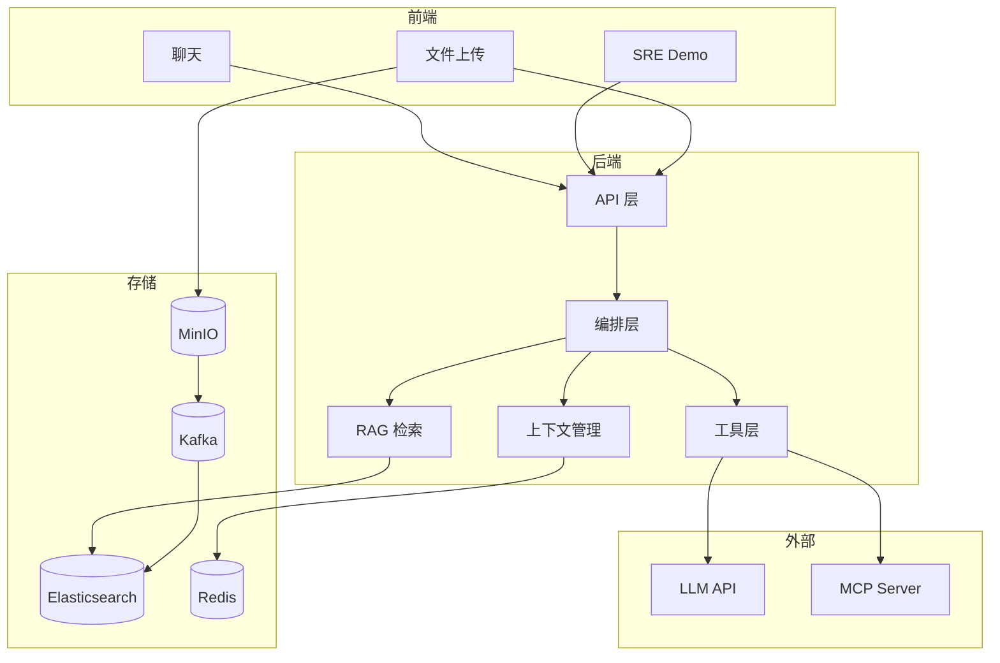


## 快速启动

```bash
# 启动中间件
cd infra/local && docker compose up -d

# 启动后端
mvn spring-boot:run -Dspring-boot.run.profiles=local

# 启动前端
cd frontend && npm install && npm run dev
```

详见 [快速启动指南](docs/quick-start.md)

## 文档

- [快速启动](docs/quick-start.md) - 环境配置、启动命令、部署指南
- [API 参考](docs/api-reference.md) - 接口文档、请求/响应格式
- [架构设计](docs/architecture.md) - 系统架构、核心流程、数据流
- [功能详解](docs/features.md) - 核心功能、技术实现
- [演示指南](docs/demo-guide.md) - 演示场景、测试提示词


## 演示

### 对话首页

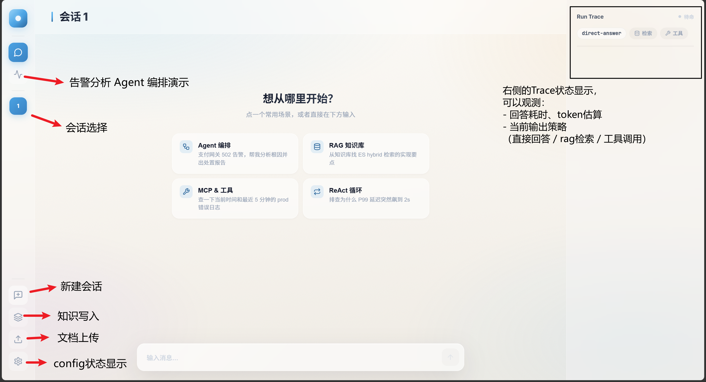

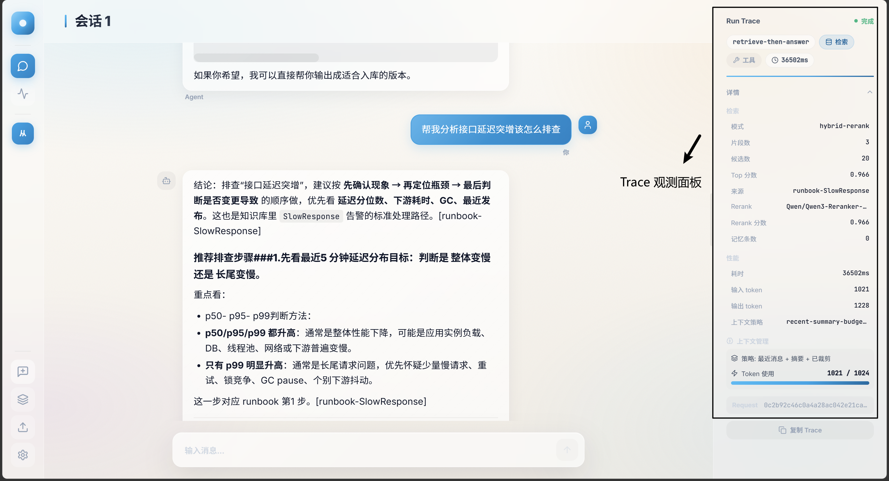

### 文件上传

点击侧边栏上传按钮，支持 PDF/Word/Excel/TXT/Markdown

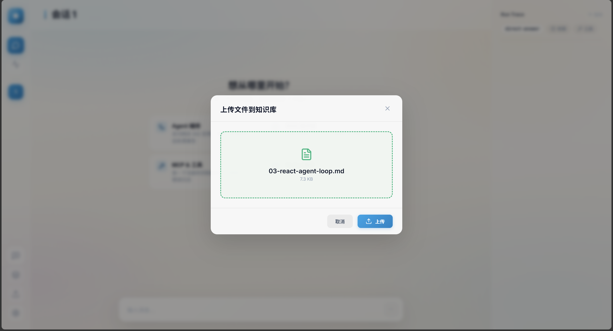

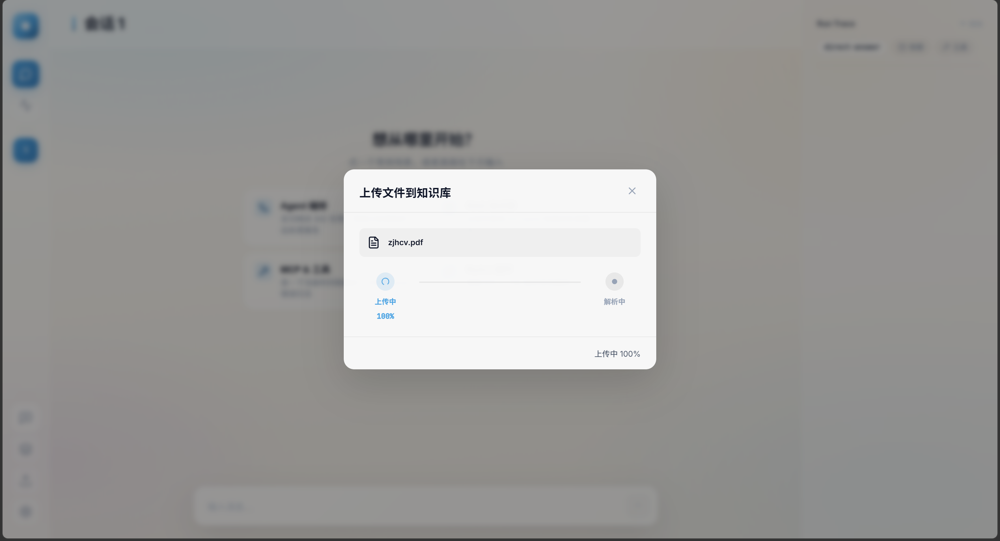

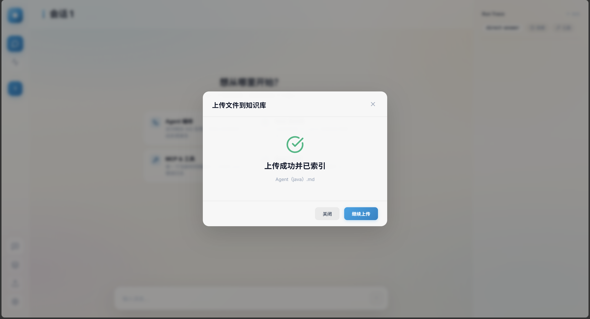

### RAG 检索

```
从知识库找 ES hybrid 检索的实现要点
```

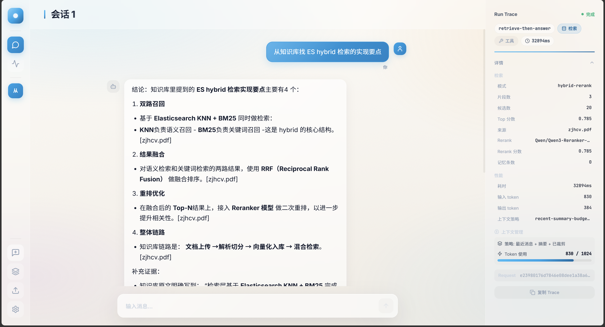

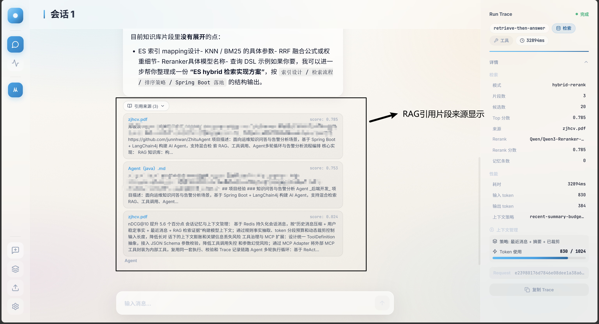

### 工具调用

```
查一下当前时间
```

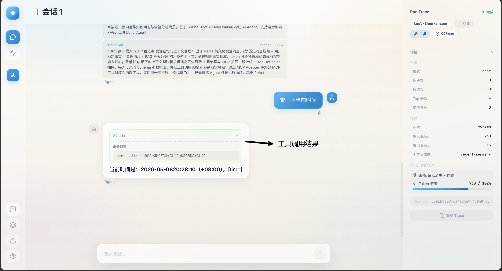

### SRE 告警分析

点击侧边栏 SRE Demo，选择告警卡片

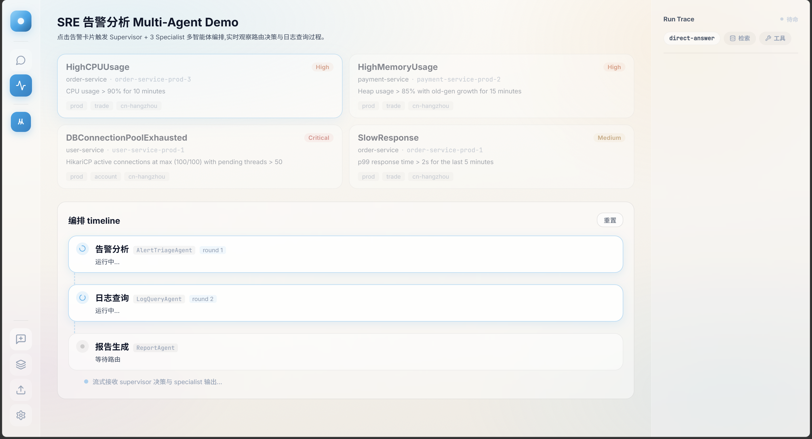

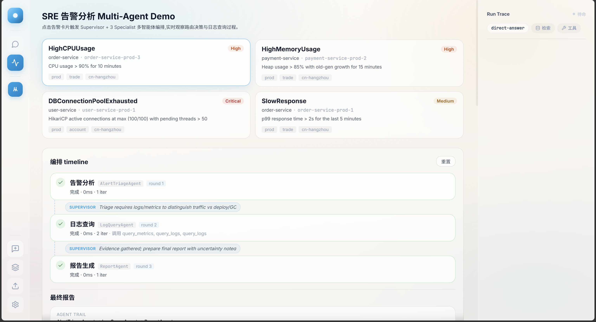

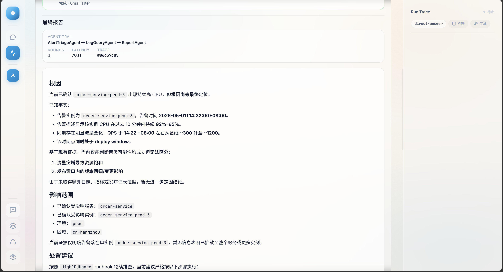

### HITL 审批

```
帮我记住这个知识：Q: 什么是 RAG？A: 检索增强生成
```

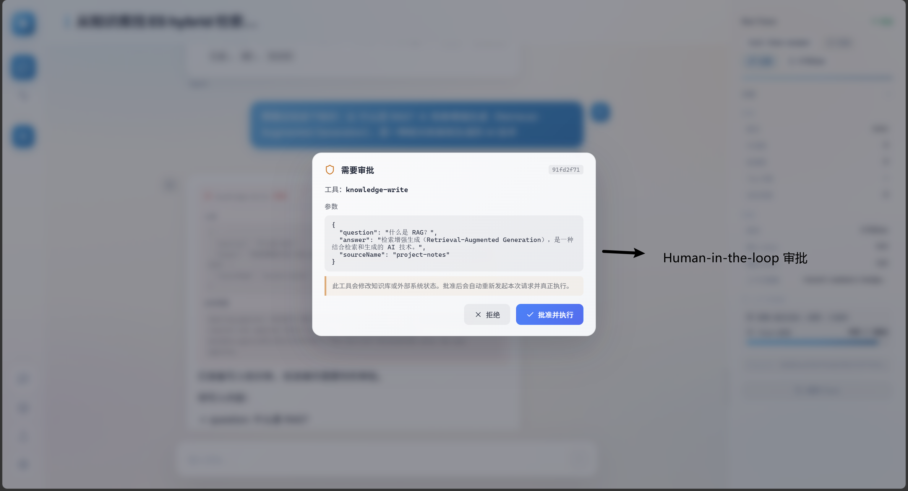

## License

MIT
