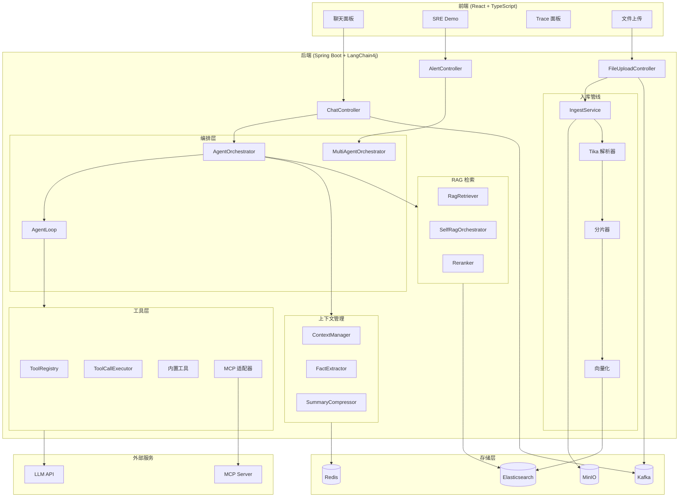
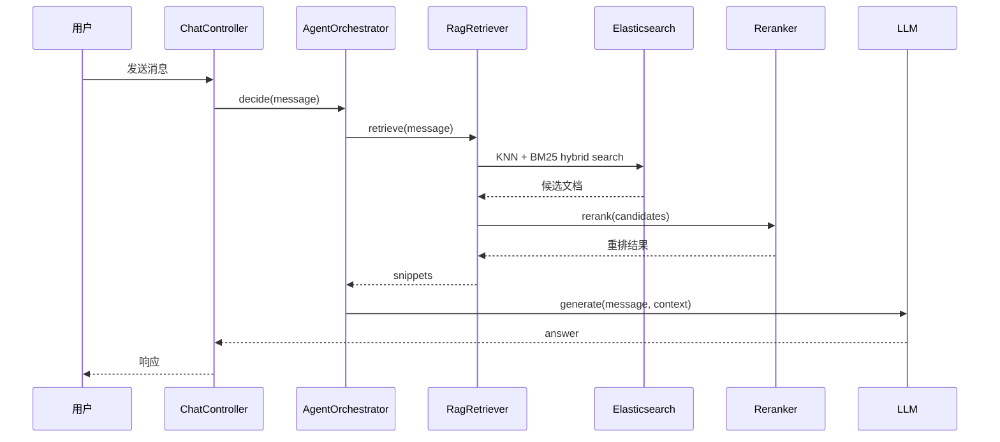
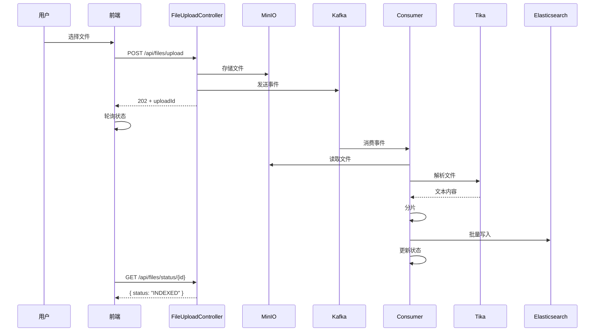
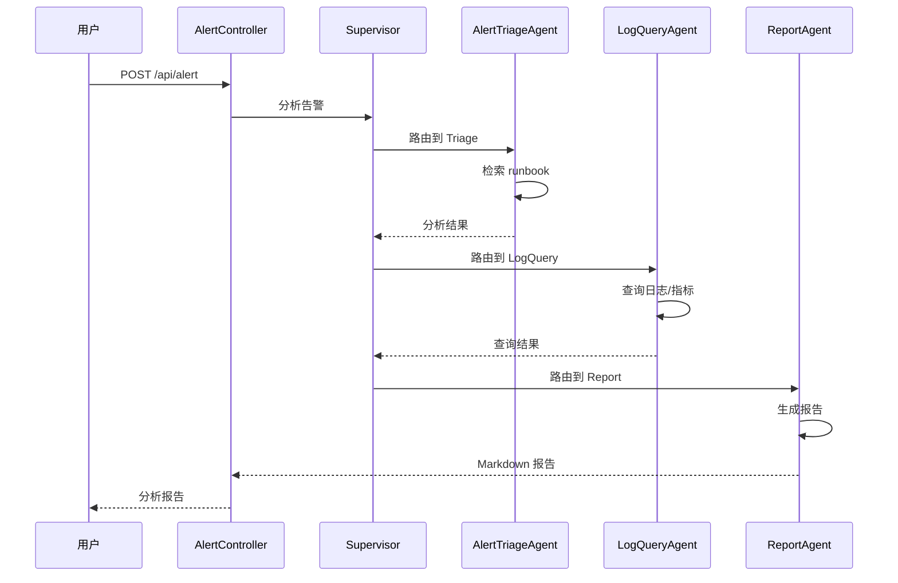
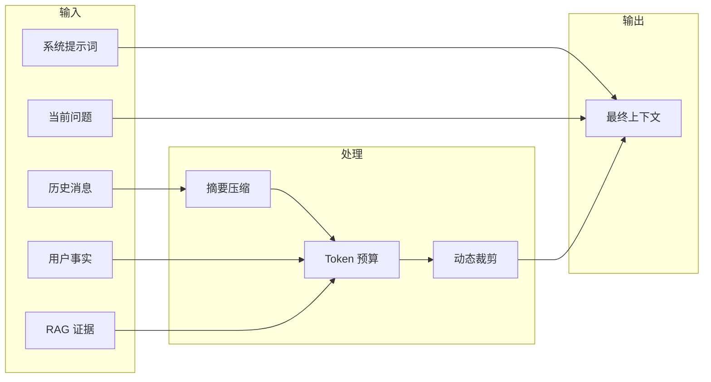

# 架构设计

## 系统架构



## 核心流程

### 1. RAG 检索流程



### 2. 工具调用流程

```mermaid
sequenceDiagram
    participant User as 用户
    participant Chat as ChatController
    participant Orch as AgentOrchestrator
    participant Loop as AgentLoop
    participant Exec as ToolCallExecutor
    participant Tool as 工具
    participant LLM as LLM

    User->>Chat: 发送消息
    Chat->>Orch: decide(message)
    Orch->>Loop: run(message)
    Loop->>LLM: generate(message, tools)
    LLM-->>Loop: tool_call
    Loop->>Exec: execute(tool_call)
    
    alt 需要审批
        Exec->>Chat: pending_approval
        Chat-->>User: 审批弹窗
        User->>Chat: 批准
        Chat->>Exec: approve(id)
    end
    
    Exec->>Tool: execute(args)
    Tool-->>Exec: result
    Exec-->>Loop: observation
    Loop->>LLM: generate(message, observation)
    LLM-->>Loop: answer
    Loop-->>Chat: answer
    Chat-->>User: 响应
```

### 3. 文件上传流程



### 4. Multi-Agent SRE 编排



## 数据流

### 上下文组装



### Token 预算裁剪策略

| 优先级 | 策略 | 说明 |
|--------|------|------|
| 1 | 裁旧消息 | 保留最近 N 条 |
| 2 | 裁旧事实 | 保留最近 1 条 |
| 3 | 移除摘要 | 完全移除 |
| 4 | 压缩 evidence | 减半 |

## 技术栈

| 层 | 技术 |
|---|---|
| 前端 | React 19, TypeScript, Vite, SSE |
| 后端框架 | Java 21, Spring Boot 3.5, Maven |
| LLM 接入 | LangChain4j 1.1, OpenAI-compatible |
| 知识库 | Elasticsearch 8.10, IK 分词, dense_vector |
| 文件存储 | MinIO |
| 文件解析 | Apache Tika, HanLP |
| 异步队列 | Kafka 3.7 KRaft |
| 缓存/记忆 | Redis |
| 监控 | Micrometer, Prometheus |
| Agent 编排 | ReAct, Supervisor + Specialist |
| 工具扩展 | MCP (Model Context Protocol) |
